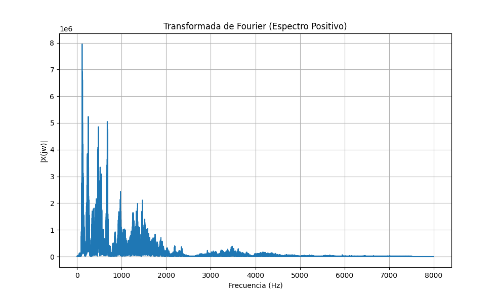
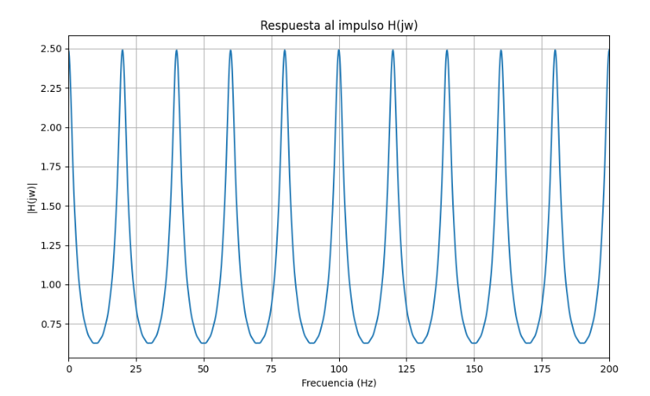
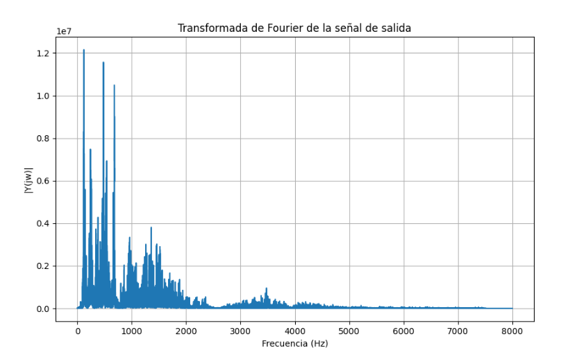

 
# README - Aplicación de Reverberación a Audio WAV
## Autores
Joseph M. Sangurima  
joseph.sangurima@ucuenca.edu.ec  
José M. Solórzano  
jose.solorzanom@ucuenca.edu.ec   
Lenin S. Anguisaca  
lenin.anguisaca@ucuenca.edu.ec  

## Descripción
Este proyecto implementa un programa para aplicar efectos de reverberación a señales de audio en formato WAV. El programa permite seleccionar una pista de audio, calcular su Transformada de Fourier (TF), y simular la reverberación mediante la multiplicación de la TF del audio original con la TF de la respuesta al impulso. Posteriormente, se obtiene la señal de salida aplicando la transformada inversa, normalizando la señal y guardándola como un nuevo archivo WAV.






## Características
Transformada de Fourier (TF): Calcula la TF de la señal de audio y de la respuesta al impulso.
Reverberación: Simula el efecto de reverberación utilizando parámetros ajustables de atenuación, período y número de reflexiones.
Normalización: Ajusta el rango dinámico de la señal resultante para evitar distorsiones.
Salida: Guarda la señal procesada en formato WAV.
Visualización: Muestra las frecuencias de la señal antes y después de aplicar la reverberación utilizando Matplotlib.
## Requisitos
Python 3.x
NumPy: Para el procesamiento de las transformadas y cálculos numéricos.
Wavefile: Para la lectura y escritura de archivos WAV.
Matplotlib: Para la visualización de las transformadas y espectros de frecuencias.

## Instalación
Clonar el repositorio:
```
git https://github.com/SephbaCode/reverbed_filter.git
cd proyecto-reverberacion.wav
```
Crear un entorno virtual (opcional, pero recomendado):

```
python3 -m venv venv
source venv/bin/activate  # En Windows usa venv\Scripts\activate
```
Instalar las dependencias:

```
pip install -r requirements.txt
```
## Uso
Coloca el archivo de audio WAV que deseas procesar en la carpeta de entrada.   

Ejecuta el script principal para aplicar la reverberación:

```
python Reverbed_filter.py
```
El programa pedirá que seleccione un archivo WAV de entrada y ajustará los parámetros de reverberación:

Atenuación: Controla la disminución de la intensidad de las reflexiones.
Período: Define el tiempo entre reflexiones consecutivas.
Reflexiones: Número total de reflexiones a considerar.
Una vez procesada la señal, el archivo resultante será guardado en la carpeta de salida.

Ejemplo de Parámetros
Atenuación: 0.6
Período: 0.05
Reflexiones: 10

